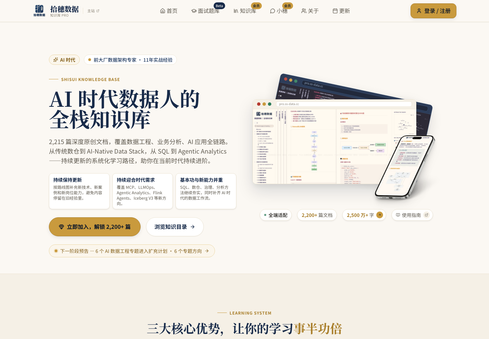

# 拾穗数据 Skills

为拾穗数据会员和数据从业者共同维护的 AI Agent Skill 开源库。

这个仓库由 **拾穗数据工作室** 发起。我们会把日常数据开发、数据分析、数据治理和 AI Agent 实践中可复用的标准动作，沉淀成一个个独立可用的 Skill。

这些 Skill 会优先服务拾穗数据会员的学习、工作和项目实践；同时，我们也把它们免费开源出来，供更多数据从业者直接使用、修改和共建。

- 拾穗数据主站：[ss-data.cc](https://ss-data.cc)
- 数据从业者全栈知识库：[pro.ss-data.cc](https://pro.ss-data.cc)


## 这个仓库是什么

数据工作里有很多动作，看起来不起眼，却决定了结果是否可靠：

- 接到一个模糊需求，怎么澄清到可以开发
- 定义一个指标，怎么避免口径打架
- 设计一张表，怎么守住粒度、分区和更新策略
- 审查一段 SQL，怎么发现漏算、重复计算和性能风险
- 上线一个数据任务，怎么补齐质量规则
- 一个经营看板，怎么判断它能不能支持业务决策
- 一个业务指标异常，怎么拆成可验证的归因路径
- 一张表或一个任务，怎么写成别人能接手的数据文档
- 一次数据事故，怎么复盘到机制改进而不是停在“这次修了”

这些不是“提示词技巧”，而是数据从业者每天都要面对的基本功。

我们希望把这些动作整理成 AI Agent 可以执行的 Skill。一个 Skill 解决一个明确问题，有独立的使用说明、使用场景、输入要求和输出模板。

如果你不确定该用哪个 Skill，可以先看 [Skill 索引](SKILL_INDEX.md)。

想看具体输入输出，可以从 [示例索引](examples/README.md) 开始。

如果你要把 Skill 用到真实工作里，建议先阅读 [上下文使用指南](CONTEXT_GUIDE.md)，并使用 [上下文模板](context/README.md) 准备材料。

如果你要新增或维护 Skill，请按 [Skill 生产 SOP](SOP.md) 执行。

## 为谁准备

这个仓库首先为拾穗数据会员准备。

会员可以把它用于：

- 日常 SQL 审查
- 指标口径讨论
- 数据需求澄清
- 数仓表设计
- 数据质量规则生成
- BI 看板审查
- 业务指标异常归因
- 数据文档与交接
- 数据事故复盘
- 面试项目复盘
- AI Agent 工作流练习

同时，它也是一个免费开源项目。即使你不是会员，也可以直接使用这些 Skill。好的方法不应该只躺在少数人的笔记里。

## 拾穗数据在做什么

拾穗数据是面向 AI 时代数据从业者的学习与实践社区。

我们关注的问题很简单：

> 当 SQL、报表和部分开发动作被 AI 快速压缩，数据人还应该靠什么继续变值钱？

我们的答案不是追热点，也不是把每个新词都包装成神谕。我们更关心三件事：

1. 数据基本功是否扎实
2. 是否能把技术动作和业务问题连起来
3. 是否能在 AI 时代重构自己的工作流

所以，拾穗数据不是一个单纯的资料堆。它更像一个面向数据人的工作台：有系统知识、有实践方法、有案例拆解，也有围绕 AI Agent、语义层、数据治理和现代数据工程的新工作流探索。



## 知识库会员

[数据从业者全栈知识库](https://pro.ss-data.cc) 是拾穗数据的核心会员产品。

它覆盖：

- 数据工程
- 数据开发与架构
- 数据分析与运营
- 数据治理与管理
- 技术工具与平台
- 行业业务知识
- 求职就业专题
- AI 与大数据
- Agent、RAG、LLMOps、MCP、Agentic Analytics 等新方向

知识库的特点：

- **体系化**：不是零散文章，而是围绕数据岗位能力搭建知识结构
- **持续更新**：跟随 AI-Native Data Stack、数据工程实践和岗位变化迭代
- **基本功与新能力并重**：SQL、数仓、治理、分析方法继续夯实，同时补齐 AI 时代的数据工作流
- **可落地**：关注数据人在真实工作里会遇到的需求、口径、建模、质量、协作和职业问题

如果你希望系统学习数据领域，或者想跟着拾穗数据一起把 AI Agent 真正用到数据工作里，可以从这里开始：

[加入拾穗数据会员](https://pro.ss-data.cc)

## Skill 地图

完整选择指南见 [Skill 索引](SKILL_INDEX.md)。

### 数据开发

| Skill | 用途 |
| --- | --- |
| `data-requirement-clarifier` | 把模糊的数据需求澄清成可开发任务 |
| `metric-definition-reviewer` | 审查指标口径、统计粒度、边界条件和业务风险 |
| `table-design-advisor` | 设计或审查数仓表结构、分层、粒度、分区和更新策略 |
| `sql-reviewer` | 审查 SQL 的逻辑正确性、性能风险和口径一致性 |
| `data-quality-rule-generator` | 根据表结构、SQL 或指标定义生成数据质量规则 |

### 数据分析

| Skill | 用途 |
| --- | --- |
| `exploratory-data-analysis` | 对新数据集做结构、质量、分布、异常和关系探索 |
| `business-root-cause-analysis` | 对 GMV、激活、留存、收入等业务指标异常做归因分析 |
| `funnel-analysis` | 分析注册、激活、下单、支付等有序转化漏斗 |
| `retention-cohort-analysis` | 分析留存、复购、活跃回访和 Cohort 差异 |
| `ab-test-analysis` | 设计、审查或解读 A/B 实验，判断实验是否可信和可推广 |

### BI 与数据产品

| Skill | 用途 |
| --- | --- |
| `dashboard-reviewer` | 审查看板是否能支持业务决策、定位问题和推动行动 |

### 文档、协作与复盘

| Skill | 用途 |
| --- | --- |
| `data-doc-writer` | 为表、指标、SQL 任务、看板或数据产品生成可交接的数据文档 |
| `data-incident-postmortem-writer` | 写数据事故复盘，沉淀影响、时间线、根因和预防措施 |

### 表达与交付

| Skill | 用途 |
| --- | --- |
| `data-analysis-report-writer` | 把分析结果整理成可决策的数据分析报告 |
| `weekly-monthly-report-writer` | 写周报、月报、项目进展和向上同步材料 |
| `data-presentation-architect` | 把分析报告、项目进展或技术内容整理成 PPT 叙事大纲 |

这些 Skill 可以单独使用，也可以组合成常见的数据工作链路：

```text
需求澄清 -> 指标口径 -> 表设计 -> SQL 审查 -> 质量规则
```

```text
数据探索 -> 漏斗/留存/实验分析 -> 分析报告 -> PPT 汇报
```

```text
业务异常 -> 归因分析 -> 看板审查 -> 分析报告 / PPT 汇报
```

```text
表设计 -> SQL 审查 -> 质量规则 -> 数据文档 -> 交接 / 复盘
```

## 设计原则

1. 每个 Skill 必须独立可用
2. 每个 Skill 只解决一个明确问题
3. 每个 Skill 必须有清晰的输入、输出和使用场景
4. Skill 不依赖私有上下文，缺失信息要显式列为假设或待确认问题
5. 多个 Skill 可以自然组合，但不能互相强依赖

一句话：

> 单独可用是底线，串联协作是加分项。

## 目录结构

```text
skills/
  README.md
  _template/
    SKILL.md
  ab-test-analysis/
    SKILL.md
  business-root-cause-analysis/
    SKILL.md
  data-analysis-report-writer/
    SKILL.md
  data-doc-writer/
    SKILL.md
  data-incident-postmortem-writer/
    SKILL.md
  data-requirement-clarifier/
    SKILL.md
  dashboard-reviewer/
    SKILL.md
  exploratory-data-analysis/
    SKILL.md
  funnel-analysis/
    SKILL.md
  metric-definition-reviewer/
    SKILL.md
  retention-cohort-analysis/
    SKILL.md
  sql-reviewer/
    SKILL.md
  table-design-advisor/
    SKILL.md
  data-quality-rule-generator/
    SKILL.md
  weekly-monthly-report-writer/
    SKILL.md
  data-presentation-architect/
    SKILL.md
```

每个 Skill 目录都以 `SKILL.md` 作为核心文件。必要时可以增加：

- `references/`：放较长的领域参考资料
- `scripts/`：放可执行脚本
- `assets/`：放模板、图片、示例文件等资源

仓库级资源：

- `SOP.md`：从需求到开发、测试、发布的标准作业程序
- `docs/skill-development-workflow.md`：Skill 开发工作流详解
- `docs/templates/skill-brief.md`：新增 Skill 前的需求定义模板
- `CONTEXT_GUIDE.md`：说明 Skill 如何配合上下文使用
- `context/templates/`：可复制的上下文模板
- `context/packs/`：预制演示上下文包
- `examples/`：脱敏示例输入和预期输出
- `scripts/check-library.mjs`：检查 Skill、示例和上下文资源是否齐全

测试方式见 [测试说明](TESTING.md)。

当前仓库包含一组 mock 测试材料，位于 `tests/`，可用于人工评测 Skill 是否能在具体上下文中工作。

## 使用方式

把某个 Skill 目录复制或安装到支持 Skill 的 Agent 环境中，然后用自然语言触发即可。

例如：

```text
请用 sql-reviewer 帮我审查下面这段 Spark SQL，重点看指标口径和性能风险。
```

或者：

```text
请用 data-requirement-clarifier 把这个需求整理成数据开发任务：
老板想看最近转化率为什么下降。
```

更推荐的方式是同时提供上下文：

```text
请使用 funnel-analysis 分析下面的问题。

上下文：
[粘贴并填写 context/templates/analysis-context.md]
```

## 共建方式

欢迎提交 Issue 或 Pull Request。

提交前请先阅读 [贡献指南](CONTRIBUTING.md)。

适合提交的内容包括：

- 新的 Skill 场景
- 现有 Skill 的输出改进
- 数据开发真实案例脱敏后的整理
- 更好的示例输入和示例输出
- 针对某个引擎或平台的补充说明

不适合提交的内容包括：

- 未脱敏的公司内部数据
- 业务系统截图、日志、表结构等敏感信息
- 只适用于某家公司内部流程的私有规则
- 空泛的提示词合集

## 后续计划

第一阶段先沉淀数据开发、数据分析和职场交付中的高频动作。

后续可以继续扩展：

- `pipeline-debugger`
- `backfill-planner`
- `lineage-explainer`
- `flink-job-reviewer`
- `data-incident-postmortem-writer`
- `data-dev-pr-reviewer`
- `warehouse-naming-linter`
- `data-doc-writer`
- `dashboard-reviewer`
- `business-root-cause-analysis`
- `data-interview-case-coach`
- `agent-skill-packager`

## 同步约定

这个仓库面向 GitHub 公共发布。可以同步的内容包括：

- 可独立使用的 Skill
- 面向用户的说明文档
- 可复用示例
- 经过整理的脚本、模板和参考资料

不应同步的内容包括：

- 临时草稿
- Agent 运行中间态
- 本地调试缓存
- 私有配置和环境变量
- 未脱敏的业务数据、日志或截图

中间材料统一放入 `tmp/`、`scratch/` 或 `workbench/`，这些目录默认不会进入 Git。

## License

本仓库采用 MIT License 开源。你可以免费使用、复制、修改和分发这些 Skill。

如果这些内容帮到了你，也欢迎访问 [ss-data.cc](https://ss-data.cc) 或加入 [拾穗数据会员](https://pro.ss-data.cc)。
