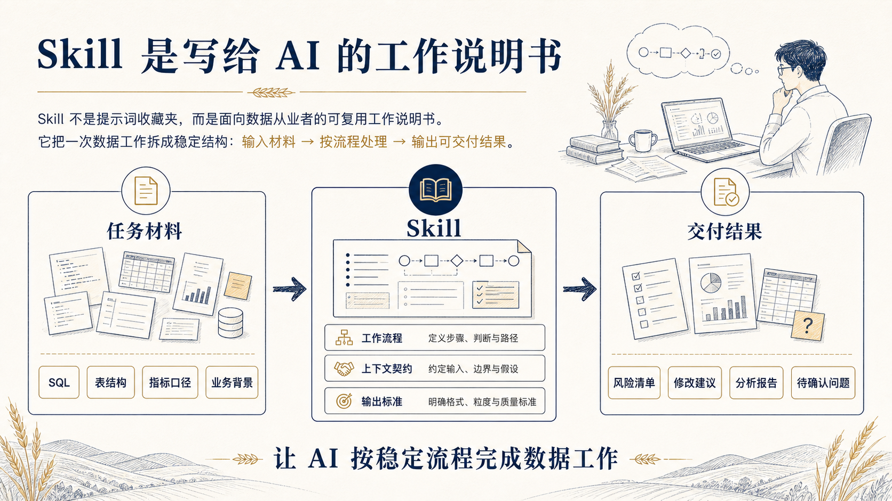
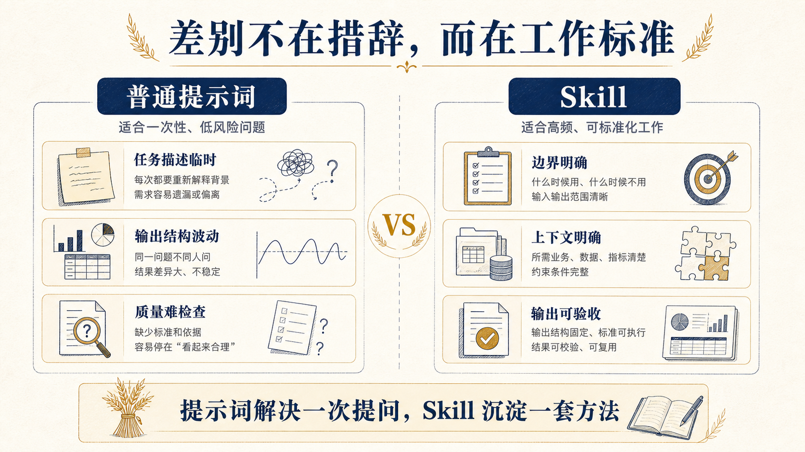
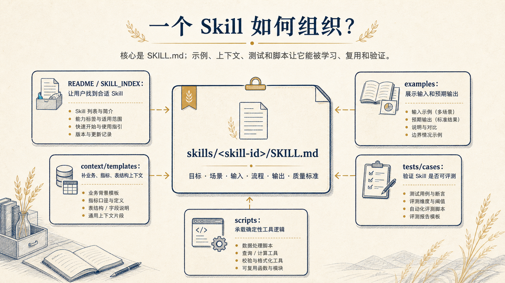
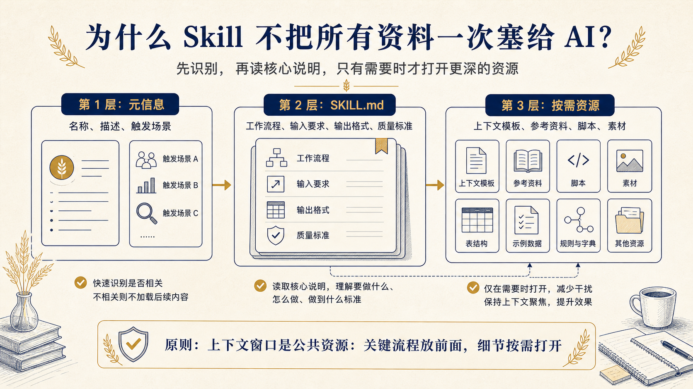
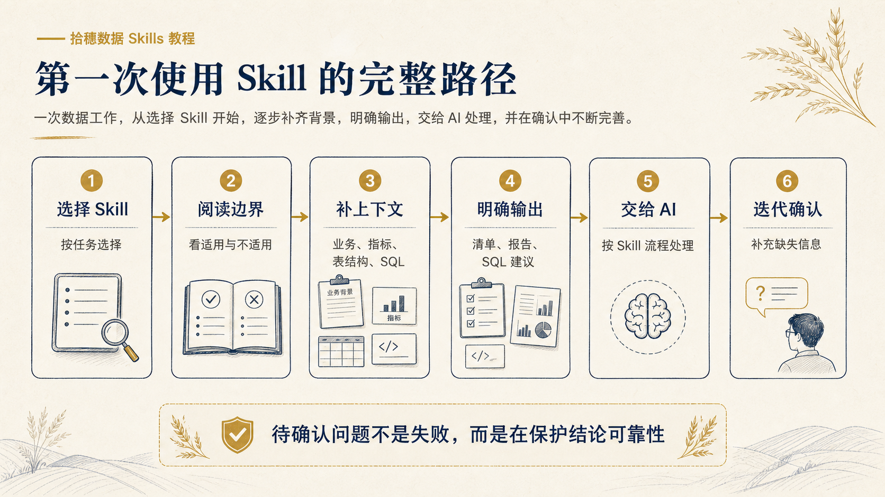
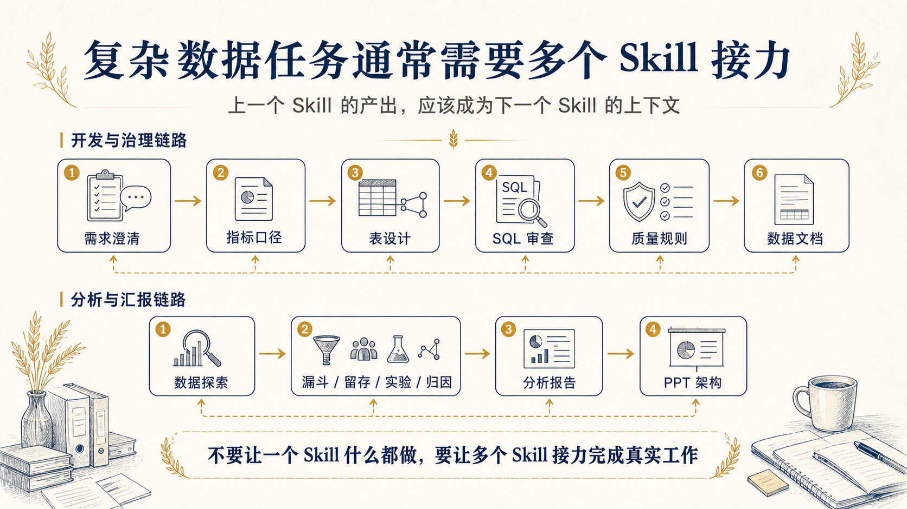
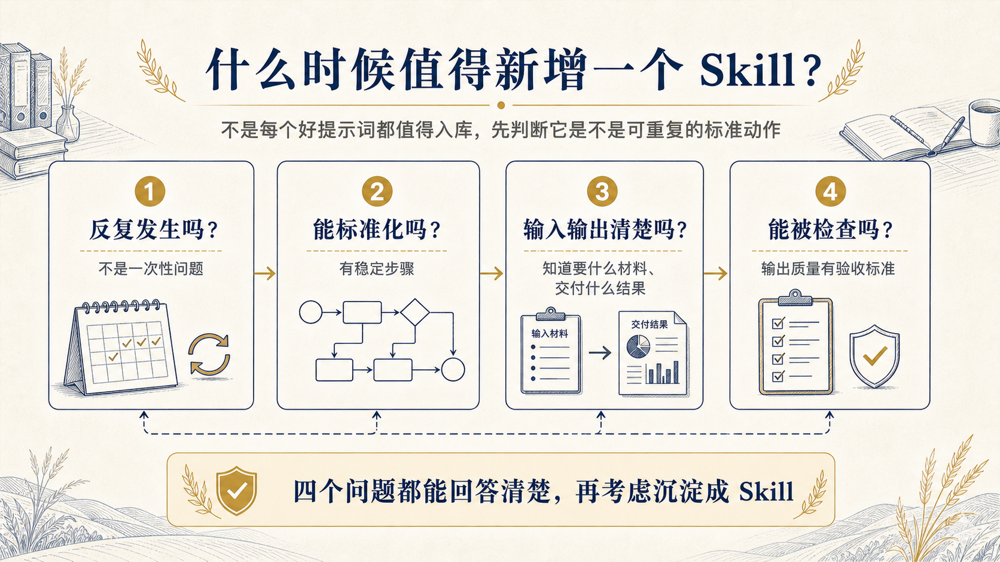

# Skill 入门教程

这份教程面向第一次接触 Skill 的数据从业者。

你不需要先懂 Agent、插件或复杂的 AI 工程概念。先把 Skill 理解成：

```text
写给 AI 的标准工作说明书。
```

它不是一句万能提示词，也不是一个会自动替你拿到公司数据的工具。它的作用是把一个高频数据工作动作拆清楚，让 AI 知道什么时候该做、需要什么材料、应该按什么流程分析、最后要交付什么结果。

下面这些图不是装饰图，而是教程内容的一部分：概念、对比、架构、原理、流程和判断都尽量用图讲清楚。



## 一图理解 Skill

Skill 解决的不是“怎么问 AI 更好听”，而是“让 AI 按稳定的专业流程做事”。

可以把它拆成一个简单公式：

```text
Skill = 工作流程 + 上下文契约 + 输出标准
```

对应到数据工作里：

| 组成 | 解决的问题 | SQL 审查示例 |
| --- | --- | --- |
| 工作流程 | AI 应该按什么步骤做 | 先看目标和粒度，再查口径、Join、过滤、性能 |
| 上下文契约 | 用户应该提供什么材料 | SQL、执行引擎、表结构、指标定义、分区字段 |
| 输出标准 | 最后结果应该长什么样 | 风险清单、修改建议、待确认问题、改写 SQL |

## 为什么不是普通提示词

普通提示词更像一次性请求，Skill 更像可复用的工作规范。



以 SQL 审查为例，你当然可以直接问：

```text
帮我看看这段 SQL 有没有问题。
```

但更可靠的方式是让 AI 按固定工作流检查：

- 先确认 SQL 的统计目标和结果粒度。
- 再检查指标口径、关联条件、过滤条件和时间窗口。
- 然后检查重复计算、漏算、NULL、分区和性能风险。
- 最后输出风险等级、修改建议和待确认问题。

这套固定工作流，就是 Skill 要沉淀的内容。

## Skill 的基本架构

在这个仓库里，每个 Skill 通常对应一个目录：

```text
skills/sql-reviewer/
  SKILL.md
```

其中 `SKILL.md` 是核心说明；示例、上下文模板、测试用例和脚本让它能被学习、复用和验证。



`SKILL.md` 通常包含：

| 模块 | 作用 |
| --- | --- |
| 目标 | 说明这个 Skill 解决什么问题 |
| 使用场景 | 说明什么时候应该用它 |
| 不适用场景 | 说明它不应该处理什么 |
| 输入信息 | 说明用户至少要提供什么材料 |
| 上下文建议 | 说明哪些背景信息会让结果更可靠 |
| 工作流程 | 说明 AI 应该按什么步骤处理 |
| 输出格式 | 说明最后应该交付什么结构 |
| 质量标准 | 说明什么样的结果才算合格 |
| 示例 Prompt | 给用户一个可以直接复制的用法 |

## 背后的原理

一个好的 Skill 不应该把所有资料一次性塞给 AI。

它更像分层说明书：先用元信息判断是否适用，再读取核心说明，只有在任务需要时才打开更深的模板、参考资料、脚本或素材。



这样做有两个好处：

- 不浪费上下文窗口，把关键流程放在最前面。
- 复杂任务仍然可以按需读取更多资源，而不是让 Skill 本体变得又长又难维护。

## 第一次怎么用

第一次使用时，不要从“我要写一个完美提示词”开始，而是按路径走。



一个通用 Prompt 可以这样写：

```text
请按下面这个 Skill 的工作方式处理我的任务。

Skill：
[粘贴对应 SKILL.md 的核心说明或示例 Prompt]

我的任务：
[写清楚你要解决的问题]

上下文：
[填写业务背景、表结构、SQL、指标口径、时间范围等信息]

输出要求：
[说明你希望得到检查清单、报告、表格、SQL 修改建议或 PPT 大纲]
```

如果你不知道应该选哪个 Skill，先从 [技能索引](../SKILL_INDEX.md) 开始。

## 怎么选择 Skill

数据工作里常见的问题，可以先按“当前要完成的工作动作”来选。

| 你现在遇到的问题 | 推荐入口 |
| --- | --- |
| 需求还不清楚 | `data-requirement-clarifier` |
| 指标或口径有争议 | `metric-definition-reviewer` |
| 要开发或审查数据任务 | `table-design-advisor`、`sql-reviewer`、`data-quality-rule-generator` |
| 要分析业务问题 | `exploratory-data-analysis`、`funnel-analysis`、`retention-cohort-analysis`、`business-root-cause-analysis` |
| 要写报告或汇报 | `daily-report-writer`、`weekly-monthly-report-writer`、`data-analysis-report-writer`、`data-presentation-architect` |
| 出现数据事故 | `data-incident-postmortem-writer` |

更细的选择方式见 [技能索引](../SKILL_INDEX.md)。

## Skill 和上下文的关系

Skill 负责“怎么做”，上下文负责“基于什么做”。

例如：

```text
Skill：SQL 审查
上下文：SQL、执行引擎、表结构、指标口径、统计粒度、时间范围
输出要求：风险清单 + 修改建议 + 可选改写 SQL
```

如果只给 Skill，不给上下文，AI 只能按通用经验检查，结论会带很多假设。

如果只给上下文，不给 Skill，AI 可能知道材料是什么，但不一定会按稳定的工作流程产出结果。

更好的组合是：

```text
Skill + 任务材料 + 上下文模板 + 输出要求
```

上下文模板见 [context/README.md](../context/README.md)。

## 示例一：SQL 审查

假设你写完一段 Spark SQL，要计算每天每个渠道的新用户首购转化率。

你可以这样组织任务：

```text
请用 sql-reviewer 审查下面这段 Spark SQL。

背景：
计算每天每个渠道的新用户首购转化率。

SQL：
[粘贴 SQL]

上下文：
- 执行引擎：Spark SQL
- 用户注册表：dwd_user_register_d
- 订单明细表：dwd_order_detail_d
- 统计粒度：dt + channel
- 新用户定义：当天注册用户
- 首购定义：注册后 7 天内首次支付成功

重点检查：
1. 是否会算错
2. 是否有口径风险
3. 是否有性能风险
4. 是否需要改写
```

一个合格输出不应该只说“SQL 看起来没问题”，而应该明确指出：

- 统计目标是否和 SQL 一致。
- Join 是否导致重复计算。
- 时间窗口是否符合“注册后 7 天内”。
- 支付成功状态是否过滤完整。
- 分区条件是否会导致扫描过大。
- 哪些信息不足，需要用户确认。

## 示例二：指标下降归因

假设业务方说：

```text
最近新用户 7 日激活率下降了，帮我看看为什么。
```

这句话还不能直接进入分析，因为目标、口径、时间范围和可拆维度都不清楚。更稳的做法是先用 `data-requirement-clarifier`，再进入 `business-root-cause-analysis`。

第一步，澄清需求：

```text
请用 data-requirement-clarifier 帮我把这个需求澄清成可分析任务。

原始需求：
最近新用户 7 日激活率下降了，帮我看看为什么。

已知信息：
- 业务：某 SaaS 产品
- 激活行为：创建第一个项目
- 可能变化：新版引导页上线、渠道投放结构变化

请输出：
需要确认的问题、分析目标、指标口径草案、所需数据、后续分析拆解。
```

第二步，再做归因：

```text
请用 business-root-cause-analysis 分析下面的问题。

异常指标：
新用户 7 日激活率从 42% 降到 31%。

时间范围：
2026-05-13 至 2026-05-19，对比前一周。

已知变化：
新版引导页上线，渠道 B 注册占比提高。

输出要求：
归因假设树、验证路径、需要的数据、下一步建议。
```

## 复杂任务要串联 Skill

一个真实数据任务，经常不是一个 Skill 就能完成。



串联 Skill 时要注意一件事：上一个 Skill 的产出，应该成为下一个 Skill 的上下文。

例如需求澄清后的“指标口径草案”和“待确认问题”，应该带入指标口径审查；指标口径审查后的“边界规则”，应该带入 SQL 审查。

## 常见误区

### 误区一：只说 Skill 名称，不给材料

错误示例：

```text
用 sql-reviewer 帮我看看。
```

更好的写法：

```text
请用 sql-reviewer 审查下面这段 Spark SQL。

背景：
计算每天每个渠道的新用户首购转化率。

SQL：
[粘贴 SQL]

重点检查：
逻辑正确性、口径风险、性能风险和改写建议。
```

### 误区二：把 Skill 当成万能助手

一个好的 Skill 应该只解决一个明确问题。

例如 `sql-reviewer` 负责审查 SQL，不负责从零定义业务目标；`data-presentation-architect` 负责组织 PPT 叙事，不负责替你编造不存在的数据结论。

如果任务很复杂，应该把多个 Skill 串起来，而不是让一个 Skill 什么都做。

### 误区三：让 AI 补全不存在的事实

Skill 可以帮你发现缺失信息，但不应该替你编造公司规则、指标口径、表结构或实验结论。

当信息不足时，合格的输出应该明确标记：

- 当前假设
- 风险点
- 待确认问题
- 在缺少信息时仍可先做的检查

### 误区四：把提示词收藏夹当 Skill 库

Skill 库不是“好用提示词合集”。

一个合格 Skill 至少要回答：

- 什么时候使用
- 什么时候不使用
- 需要什么输入
- 按什么流程处理
- 输出什么结果
- 什么样的结果算合格

如果只有一句提示词，没有输入要求、流程和质量标准，它更适合作为示例 Prompt，而不是独立 Skill。

## 什么时候需要新增 Skill

当你反复遇到同一种数据工作场景，并且每次都要重复解释处理流程时，就可以考虑新增 Skill。



适合新增 Skill 的场景：

- 高频发生
- 可以标准化
- 输入和输出相对明确
- 不依赖某家公司私有流程
- 结果可以被检查
- 对其他数据从业者也有复用价值

不适合新增 Skill 的场景：

- 一次性问题
- 只有观点，没有操作流程
- 太大太泛，什么都想管
- 依赖未脱敏的内部数据或系统规则
- 无法判断输出质量

如果你要贡献新 Skill，可以继续看 [贡献指南](../CONTRIBUTING.md) 和 [Skill 生产 SOP](../SOP.md)。

## 最小行动清单

读完这篇教程后，不需要马上理解所有概念。先完成一次最小实践：

1. 选一个真实任务。
2. 从 [技能索引](../SKILL_INDEX.md) 选 Skill。
3. 复制示例 Prompt。
4. 补充上下文模板。
5. 让 AI 输出。
6. 检查待确认问题。
7. 补充信息后迭代一次。

使用 Skill 前，可以先问自己三个问题：

1. 我现在要完成的是哪一个具体工作动作？
2. 我给 AI 的材料够不够支撑这个动作？
3. 我希望 AI 最后交付什么格式的结果？

这三个问题清楚了，Skill 才能真正发挥作用。

拾穗数据技能库希望沉淀的不是“更会提问的技巧”，而是 AI 时代数据从业者可以复用、可以交接、可以持续改进的工作方法。
